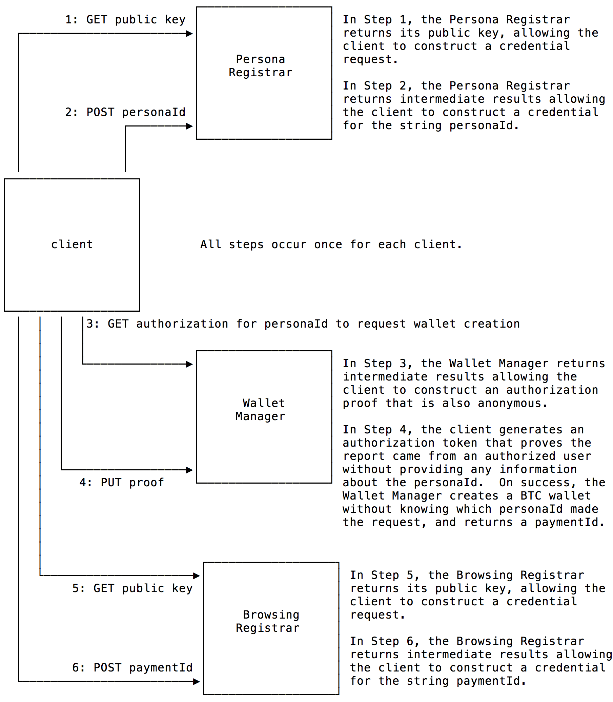
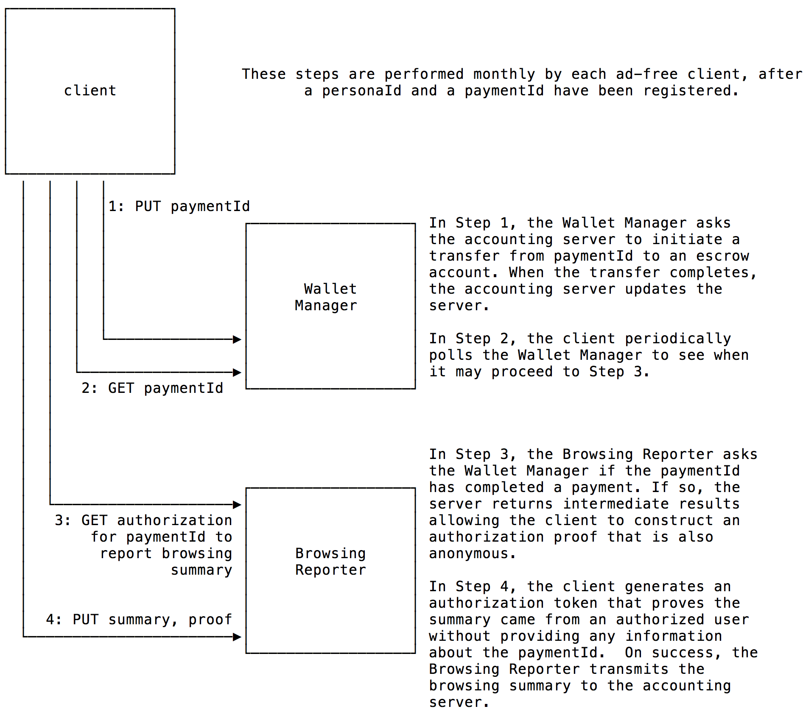
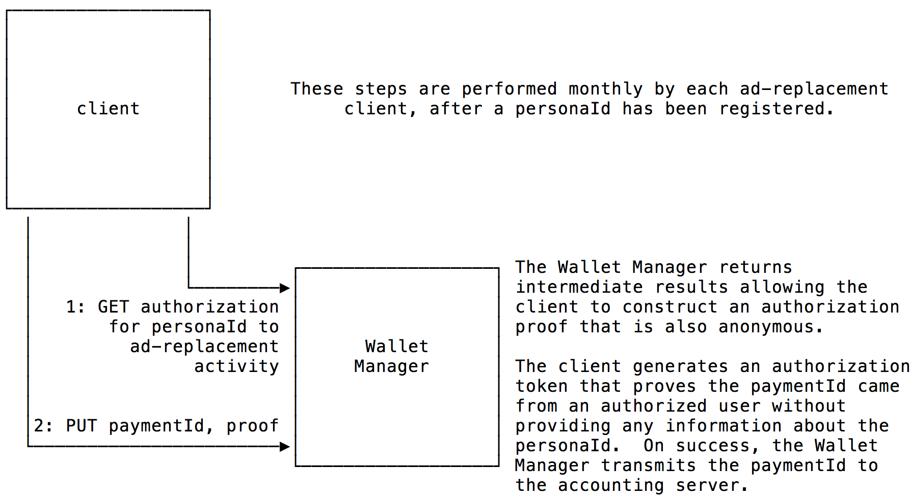

# Principles of Using the Brave Ledger (0.3.3)
The Brave Ledger is a BTC-based micropayments system for users and publishers.

To begin to understand the Ledger,
it's helpful to understand a few concepts from the
[Brave Vault](https://github.com/brave/vault/blob/master/documentation/Vault-Principles.md).
In particular,
a _persona_ is an anonymous identity -- it identifies a set of browsing behaviors without actually knowing who you are.

From the Ledger's perspective,
the most important property of a persona is the value of its `Bravery` setting.
At present,
there are two possible values `ad-free` and `ad-replacement`.
If the browsing experience is `ad-free`,
then third-party advertisements are not displayed by the browser;
otherwise,
third-party advertisements are replaced by the browser.

## Behavior

Accounting interactions with consumers are:

- anonymous: Brave Software should not be able to correlate browsing history with payments; and,

- accountable: Brave Software should be able to reconcile payments and browsing history _only_ on an aggregated basis.

Note that payments to personas and publishers are made to verified BTC wallets,
even though the browsing history of each persona is anonymous.

### Who Funds Whom
There are two ways in which "money enters the system":

- a persona with a `Bravery` setting of `ad-free` makes a periodic payment; and,

- an advertiser makes a payment commensurate with the aggregate impressions of advertisements served by Brave Software.

There are two ways in which "money leaves the system":

- a persona with a `Bravery` setting of `ad-replacement` receives a percentage of the advertiser payments;

- a publisher receives a share of the aggregated payments associated with
the viewing habits of personas who visit that publisher's site.

Of course,
Brave Software receives a percentage of the payments entering the system.

In order for either a persona or publisher to be paid,
they must have a verified wallet.
Brave Software oversees the verification process (though it may use third-parties for this purpose).
There are different rules for verification for personas and publishers:

- very small amounts are transferred to personas --
so verification (whilst necessary) is lightweight
(e.g., verification by "ownership" of an email address and a phone number);
in contrast,
- potentially large amounts are transferred to publishers --
so verification is more extensive,
depending on the size and frequency of payments,
e.g., similar to the verification spectrum seen for
[DV, OV, and EV certificates](https://cabforum.org/info-for-consumers/).

### The Peanut-Butter Process
At the end of each reconciliation period (e.g., every 30 days since client initialization),
the accounting server performs the _peanut-butter process_ in order to determine the amount to fund
both personas with a `Bravery` setting of `ad-replacement`, and publishers.

On each day,
the total payments from `ad-free` personas are aggregated into one sum,
and the total publisher views from those personas are aggregated into a weighted list.
For example,
if site "X" has twice as many publisher views as site "Y",
then the weight for site "X" is twice as large as the weight for size "Y"
The payments sum (less Brave Software's processing fee, e.g., 5%)
is then divided by the sum of weights in order to determine the payment ratio,
and then the payment to each publisher is calculated by multiplying the ratio by the weight.
(Accordingly,
site "X" should receive twice as much as site "Y".)

By way of example,
if the total revenue from `ad-free` personas was 1000.00BTC,
then Brave Software would receive 50.00BTC,
a site receiving 10% of the total views would receive 95.00BTC,
a site receiving 5% of the total views would receive 47.50BTC,
a site receiving 1% of the total views would receive 9.50BTC,
and so on.

Similarly,
the total payments from advertisers are aggregated into one sum,
and the total views from the `ad-replacement` personas are aggregated into a weighted list for publishers.
From the total payment,
our ad-match partner takes a share (15%),
Brave Software takes a share (15%),
a certain percentage of the total payment is reserved for `ad-replacement` personas (15%),
and the remaining amount is allocated to the publishers (e.g., 55%).
The payment to each publisher is then calculated using the weighted-ratio method.
In order to enhance privacy,
the payment to each `ad-replacement` persona are calculated independently of the actual impressions served to each persona --
Brave Software does not keep track of which personas are served which impressions.

## Model
The client is responsible for reconciling persona behavior with the Ledger.
(However,
Brave Software's advertising and accounting servers provide the usual checks for click fraud, etc.)

The default `Bravery` setting for the client is `ad-replacement`.
If `ad-free` is selected by the user,
then,
depending on the configuration of the client:
the user may select a fixed payment amount,
or select an amount from a list of choices,
or enter an amount (subject to an upper limit),
or even select a "no payment" option.

### Authorized, but Anonymous, Transactions
The Brave Ledger uses [Anonize](https://anonize.org/assets/technology.html) in order to process authorized but anonymous
transactions.
This anonymization process allows the client and Brave Ledger to authoritatively agree on behavior without linking that
behavior to personas, browsers, or wallets.

Although "the math" behind Anonize is "rather complicated",
its operational properties are straight-forward:

1. There are two servers: a "registrar" and a "reporter"

2. A client contacts the registrar,
downloads its public key.

3. The client generates its own public and private keys,
constructs a request containing a unique identifier and a cryptographic proof based on the registrar's public key and the
client's secret key,
and sends the request to the registrar.

4. If the registrar "likes" the request,
it sends back an "intermediate result" that allows the client to construct a "master user token",
which it can then use when making requests to the reporter.

Whenever the client sends a request to the reporter:

1. The client sends the unique identifier to the reporter,
and the reporter sends back an "intermediate result".

2. The client delays an unpredictable amount of time (to avoid timing correlation attacks).

3. Using its own secret key and the result from the reporter,
the client generates a "one-time unlinkable token" and uses that to sign a request to the reporter.

4. When the reporter examines the request,
it is able to determine that the signature was from a user that is authorized by the registrar; however --
and this is the _really clever_ part --
the reporter is not able to determine which authorized user generated the request.
However,
the reporter is able to determine whether the request is a duplicate.

Of course,
this is a very simplistic explanation of how Anonize works.
If you'd like more details,
here are two excellent technical papers:

* [An Overview of ANONIZE: A Large-Scale Anonymous Survey System](https://anonize.org/assets/anonize-ieee-special.pdf),
IEEE Security and Privacy Magazine, 2015.

* [ANONIZE: A Large-Scale Anonymous Survey System](https://anonize.org/assets/anonize-oak-camera.pdf),
Oakland Security and Privacy Conference, 2014.

### Taxonomy of Servers
All servers described in the model are operated by Brave Software.

| Server | Purpose       |
|-------:|---------------|
| Persona Registrar      | registers a Brave persona |
| Wallet Manager         | returns a wallet to an anonymous Brave persona |
| Browsing Registrar     | registers a Brave wallet for ad-free browsing |
| Browsing Reporter      | associates a browsing summary for ad-free browsing with an anonymous Brave wallet  |

### Initialization
When a user starts the client for the very first time,
the client goes to the [Brave Vault](https://github.com/brave/vault/blob/master/documentation/Vault-Principles.md)
to create a repository for a `personaId`.

After creating a `personaId`,
the client interacts with a Persona Registrar, a Wallet Manager, and a Browsing Registrar,
as shown pictorially:

#### A: The client goes to a Persona Registrar...
...to register the `personaId` and create the corresponding credential:

1. The client invokes the `GET /v1/registrar/persona/publicKey` operation to retrieve the Persona Registrar's public key.

2. The client computes its local calculations and then performs the `POST /v1/registrar/persona/{personaId}` operation with
its proof.

3. The Persona Registrar,
as a part of its processing,
performs the `GET /v1/users/{personaId}` operation to the Brave vault to verify that `personaId` is known.

4. On success,
the Persona Registrar returns the result of its calculations,
along with the the URL for the Wallet Manager and a `surveyorId`.

5. The client completes generation of the credential for `personaId`,
and stores this information in persistent, secure storage.

#### B: The client goes to a Wallet Manager...
...to request the creation of a BTC wallet:

1. The client invokes the `GET /v1/surveyor/wallet/{surveyorId}/{personaId}` operation
to retrieve the information necessary to submit a proof.

2. On success,
the Wallet Manager returns the result of its calculations.

3. The client calculates its proof.

4. To avoid timing attacks, the client stores this information in persistent, secure storage,
and does not proceed until an unpredictable delay (of upto 30 days) occurs -- prior to first reconciliation.

5. The client performs the `PUT /v1/surveyor/wallet/{surveyorId}` operation with its proof.

6. On success,
the Wallet Manager generates an unpredictable `passphrase` and creates a new BTC wallet using 
`createWalletWithKeychains()` and the `passphrase`, and:

    - generates a `paymentId` (an opaque alias for the BTC address), storing both it and the associated BTC address;

    - sends the BTC address (`wallet.id`),`result.backupKeychain`, `passphrase`, and `paymentId`
to the accounting server for "offnet" processing;

    - sends the `paymentId` to the Browsing Registrar; and,

    - returns the URL for the Browsing Registrar, along with the BTC address and `paymentId` to the client.

    (The `paymentId` is used to prevent disinterested blockchain observers from being able to invoke wallet-related
     operations on the Brave Ledger.)

7. The client stores this information in persistent, secure storage.

At this point,
the BTC wallet is known to Brave Software,
but Brave Software is unable to determine the associated `personaId`.

#### C: The client goes to a Browsing Registrar...
...to register the `paymentId` for future use:

1. The client invokes the `GET /v1/registrar/browsing/publicKey` operation to retrieve the Browsing Registrar's public key.

2. The client computes its local calculations and then performs the `POST /v1/registrar/browsing/{paymentId}` operation with
its proof.

3. The Browsing Registrar,
as a part of its processing,
verifies that the `paymentId` is known to the Wallet Manager.

4. On success,
the Browsing Registrar returns the result of its calculations,
along with the the URL for the Browsing Reporter.

5. The client completes generation of the credential for `paymentId`,
and stores this information in persistent, secure storage.

### User Interaction
The first part of reconciliation involves interaction with the user:

1. Inform the user when a periodic reconciliation is ready for review.

    - For `ad-free` personas: inform the user if additional funding is necessary
(if funding does not occur within a grace period,
then the `Bravery` setting changes from `ad-free` to `ad-replacement` within the client).

    - For `ad-replacement` personas: 
Until the user creates a verified wallet,
if the user has not verified their Bravery wallet,
then inform the user -- that if they want to receive a portion of the advertising revenue --
they need to verify the wallet,
and give the user an option to go through [the verification process](#ad-replacement-personas).

2. For `ad-free` personas:
allow the user to review (and potentially curate) the publishers/amounts prior to reconciliation.
For example,
depending on the configuration of the client,
the user's top 20 sites by time spent may comprise the publishers to be credited.
However,
the user may choose to curate the list by adding or removing sites or modifying weights.

3. The client now interacts with the server to effect reconcilation.

### Ad-free Bravery
Pictorially,
the ad-free behavior is:

#### Client/Server Interaction

1. The client performs the `PUT /v1/wallet/{paymentId}` operation with the Wallet Manager.

2. The Wallet Manager sends the associated BTC address to the accounting server for "offnet" processing.

3. The accounting server initiates a BTC transfer from that wallet to a Brave escrow account.

4. On success,
the accounting server informs the Wallet Manager that the `paymentId` is authorized to submit a proof for a given `surveyorId`.

5. The client periodically polls performing the `GET /v1/wallet/{paymentId}` operation with the Wallet Manager to determine
the the URL of the Browsing Reporter and the `surveyorId` to use.
(This is necessary to ensure that the transaction has been successfully completed by the accounting server --
in practice,
the client _could_ monitor the BTC blockchain to look for the transaction -- several companies provide API access,
e.g., [BitGo](https://www.bitgo.com/platform), [Blocktrail](https://www.blocktrail.com/api), etc.)

6. The client invokes the `GET /v1/surveyor/browsing/{surveyorId}/{paymentId}` operation on the Browsing Reporter
to retrieve the information necessary to submit a proof.

7. On success,
the Browsing Reporter returns the result of its calculations.

8. The client calculates its proof.

9. To avoid timing attacks, the client stores this information in persistent, secure storage,
and does not proceed until an unpredictable delay (of upto 24 hours) occurs.

10. The client performs the `PUT /v1/surveyor/browsing/{surveyorId}` operation with its proof and a summary of the 
browsing history (e.g., "the top 20 sites by time spent").

11. On success,
the Browsing Reporter sends the `surveyorId` and browsing history to the accounting server for "offnet" processing.

#### Server Processing

Once a request is accepted,
the accounting server examines each publisher in the browsing history:

- If any publisher is not on the white list,
then a record is generated allowing operations to investigate.
The _dashboard_ is designed to allow an operator to transter the record into one of several queues for processing,
each with the ultimate goal of creating a verified wallet for the publisher and adding the publisher to the whitelist
(in the most automated fashion possible).

When a reconcilation period is closed:

- The accounting server calculates the aggregated payments,
subtracts the processing fees for Brave Software,
and then computes the result based on the aggregated weighted publisher lists.

- For publishers:

    - if there is a verified Bravery wallet associated with a publisher,
then the corresponding amount is transferred to the publisher's wallet; otherwise,

    - the corresponding amount is transferred to a "pending publisher" Brave escrow account,
waiting for an operator to associate a verified Bravery wallet with that publisher.

### Ad-Replacement Bravery
Pictorially,
the ad-replacement behavior is:

#### Client/Server Interaction

1. The client invokes the `GET /v1/surveyor/wallet/{surveyorId}/{personaId}` operation on the Wallet Manager
to retrieve the information necessary to submit a proof.

2. On success,
the Wallet manager returns the result of its calculations.

3. The client calculates its proof.

4. To avoid timing attacks, the client stores this information in persistent, secure storage,
and does not proceed until an unpredictable delay (of upto 24 hours) occurs.

5. The client performs the `PUT /v1/surveyor/wallet/{surveyorId}` operation with its proof and its `paymentId`.

6. On success,
the Browsing Reporter sends the `surveyorId` and `paymentId` to the accounting server for "offnet" processing.

#### Server Processing
Once a request is accepted,
the accounting server records the `paymentId` for the current monthly period.

##### A: When the billing period for an ad campaign has ended...

1. The accounting server reconciles the impression counts with the ad provider.

2. The accounting server calculates the total user revenue share,
and credits this to an escrow account for the currently monthly period.

3. The accounting server calculates the publisher share based on the impressions,
and credits this to the associated wallet for publisher.

##### B: When a monthly period has ended...

1. The accounting server divides the total amount of the associated escrow account by the number of `paymentIds` that
self-reported for the monthly period,
and credits the associated wallets equally.

2. If any unverified wallet has not self-reported for two months in a row,
then the balance of the wallet is transferred to an escrow account for the next monthly period.

## Wallet Management

### Ad-free personas
The client prompts the user,
as appropriate,
to fund the Bravery wallet.
(Of course,
the user may employ an "auto transfer" facility with their own wallet provider.)
As noted earlier,
if the wallet is not funded in a timely fashion,
then the persona's `Bravery` setting changes from `ad-free` to `ad-replacement`.

### Ad-replacement personas
Until the user creates a verified wallet,
the persona is able to view the wallet balance
(the client invokes the `GET /v1/wallet/{paymentId}` operation on the Wallet Manager),
but will not be able to spend funds deposited to the wallet.

If the user directs the client to create a verified wallet,
the client invokes the `GET /v1/oauth/bitgo/{paymentId}` operation,
which redirects the user to [BitGo's servers via the OAuth process](https://www.bitgo.com/api/#3rd-party-bitgo-login).
The user will authorize their existing account (or more likely create a new one) and allow Brave Software access to that
account.
In order to createa BitGo account,
the user must be able to demonstrate control of a mailbox and a phone number
(for [2FA](https://en.wikipedia.org/wiki/Two-factor_authentication)).

On success,
the Wallet Manager uses `client.authenticateWithAuthCode()` to retrieve access information for the user,
and then uses `client.me()` to verify that the `user.email.verified` and `user.phone.verified` properties are set,
and that both properties are unique for all verified wallets.
If so,
it invokes the `shareWallet` call to give the user the ability to view and spend.
Finally,
the Wallet Manager informs the accounting server for "offnet" processing:
it will periodically verify that Brave Software continues to have access to the BitGo wallet.
If access is revoked,
payments to the wallet are suspended until this is corrected.

## Notes on Operational Security

### Use of URLs
URLs returned may be "minified" to reduce packet size.

### Correlating the `GET {surveyorId}/{uuId}` and `PUT {surveyorId}` operations
When the client performs the `GET /v1/surveyor/.../{surveyorId}/...` operation,
it necessarily identifies itself to the Wallet Manager (or the Browsing Reporter) in order to receive a secret that will
authorize it to anonymously perform the `PUT /v1/surveyor/.../{surveyorId}` operation.

However,
there are two ways that Brave Software or a third-party observer can correlate the operations:
timing and IP addresses.

To avoid correlation via timing,
the steps above indicate when an unpredictable delay should be interposed by the client when performing the operations.

To avoid corrleation via IP address,
an IP address obfuscation technology is used to blind the IP address.
__actual technology: [TBD]__.

### Control of the Wallet
In order to transfer funds from a BitGo wallet,
two parties must agree in order to transfer funds from the wallet.

The current design divides control of the wallet to two parties: Brave Software and BitGo.
Once the wallet is verified,
then the client is a party to this joint control.

### Use of Policy for Client Wallets
A verified wallet will be limited as to its daily velocity.

### Use of Policy for Brave Escrow Wallets
These wallets will be "locked-down" to permit transfers only to other Brave wallets.
In turn these wallets,
which will be rotated frequently will be used to transfer into publisher and persona wallets.

### Loss of Keys by Brave Software
The accounting server will automatically download all information sent to it from the Wallet Manager and the Browsing Reporter to "cold storage" for recovery as
needed.

### Loss of the wallet by the user
For `ad-replacement` personas,
payments into a verified wallet are very small amounts.
Most users may not wish to be bothered by transferring the funds out,
and instead opt to have their "favorite" sites receive the payments.

However,
some users may wish to withdraw the funds from their verified wallets.
To safeguard against catastrophic destruction of the client,
the Ledger provides an API call that takes an email address and phone number,
and if this information corresponds to a verified wallet,
then a round-trip to either the email address or phone number will result in a new OAuth interaction with BitGo's servers.
Upon success,
the corresponding wallet is shared with the new BitGo account.

Of course,
in order to minimize the amount of funds in a verified wallet,
depending on the configuration of the client,
it may advise the user whenever a deposit is made to the wallet.

## Acknowledgements
Many helpful comments have dramatically increased the readability and correctness of this specification.
In particular,
the comments of [Alex Melville](https://github.com/Melvillian) of [BitGo](https://www.bitgo.com) have been particularly helpful.
